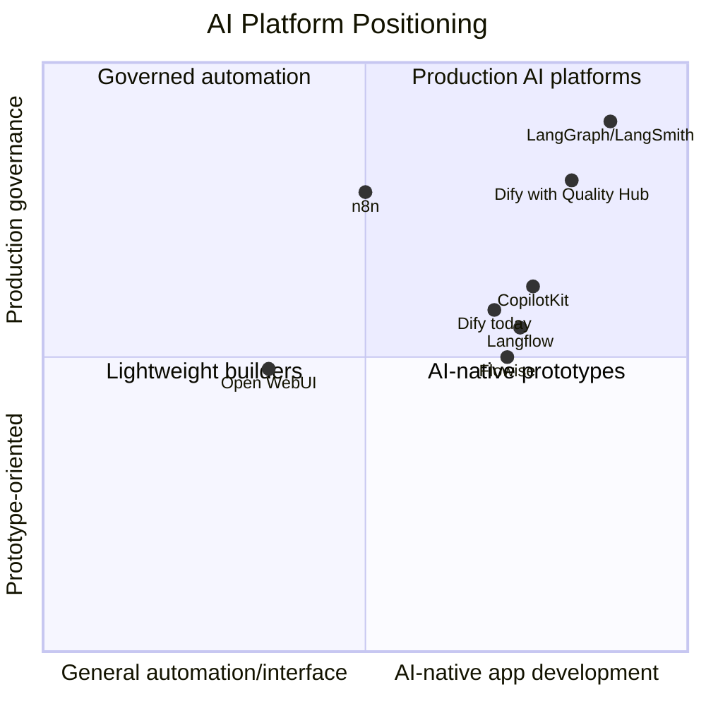

# Competitive Analysis

## Market Category

Dify competes across several overlapping markets:

- Low-code AI application builders.
- AI workflow orchestration.
- RAG application platforms.
- Agent development platforms.
- Internal AI portals.
- LLMOps and AI observability adjacency.
- Enterprise automation.

## Competitive Matrix

| Product | Positioning | UX | Pricing model | Community | Enterprise readiness | AI workflow capability | Agent capability |
|---|---|---|---|---|---|---|---|
| Dify | Open-source agentic workflow and LLM app platform | Visual app studio | Free/self-host, cloud tiers, enterprise | Very strong | Medium-high | Strong | Strong |
| Langflow | Low-code builder for agents, RAG, and MCP servers | Visual flow editor | OSS plus cloud/pro services | Very strong | Medium-high | Strong | Strong |
| Flowise | Visual platform for agents and LLM workflows | Node builder, practical builder UX | Free/self-host plus paid cloud | Strong | Medium | Strong | Strong, including Agentflow |
| Open WebUI | Self-hosted AI interface and internal portal | Chat-first UI | OSS plus enterprise options | Very strong | Medium-high | Moderate | Moderate |
| LangGraph | Code-first runtime for reliable agents | Developer/code-first | OSS plus LangSmith platform | Strong | High | Very strong | Best-in-class durable agents |
| n8n | Workflow automation for technical teams with AI features | Mature automation canvas | Cloud execution-based, self-host, enterprise | Massive | High | Strong for business workflows | Growing |
| CopilotKit | Enterprise agentic frontend stack | SDK/component-first | OSS plus paid platform | Strong | Medium-high | Not workflow-first | Strong user-facing agents |

## Evidence Notes

- Langflow markets itself as a low-code AI builder for agents, RAG applications, and MCP servers ([Langflow](https://www.langflow.org/)).
- Flowise docs list visual builder, tracing and analytics, evaluations, human-in-the-loop, API, CLI, SDK, embedded chatbot, teams, and workspaces ([Flowise docs](https://docs.flowiseai.com/)).
- Open WebUI emphasizes extensibility with tools, pipelines, MCP, OpenAPI servers, and community extensions ([Open WebUI features](https://docs.openwebui.com/features/)).
- LangGraph is positioned as an orchestration runtime with durable execution, streaming, human-in-the-loop, and persistence, with LangSmith for tracing and evaluation ([LangGraph docs](https://docs.langchain.com/oss/python/langgraph/overview)).
- n8n markets AI workflow monitoring, execution inspection, version tracking, debugging, audits, and compliance ([n8n AI](https://n8n.io/ai/)).
- CopilotKit positions itself as an enterprise agentic frontend stack ([CopilotKit](https://www.copilotkit.ai/)).

## SWOT Analysis

### Strengths

- Unified AI app builder, workflow engine, RAG platform, and runtime.
- Strong open-source adoption and community visibility.
- Self-hosting and model neutrality.
- Visual builder accessible to non-specialist teams.
- Native knowledge/RAG orientation.
- Growing plugin and MCP surface.

### Weaknesses

- Native evaluation workflow is not yet first-class.
- Cost and token analytics are not deep enough for multi-step production workflows.
- Debugging can become fragmented between logs, workflow UI, and external tracing tools.
- Enterprise controls exist, but quality governance is not a visible product pillar.
- Scheduling and broad automation are weaker than n8n.

### Opportunities

- Own "visual AI app quality management" for open-source agentic apps.
- Convert logs and feedback into evaluation datasets.
- Add release gates and quality scorecards for enterprise adoption.
- Create monetizable governance and analytics capabilities.
- Integrate with external observability while making Dify the decision surface.

### Threats

- LangGraph/LangSmith can capture production-grade AI engineering teams.
- n8n can capture automation-first buyers with stronger governance and execution visibility.
- Flowise and Langflow can copy workflow builder features quickly.
- Open WebUI can win internal AI portal use cases.
- Cloud model providers may bundle app-building and eval tooling.

## Strategic Positioning Map

## Feature Gap Analysis

| Capability | Dify status | Competitive pressure | Recommendation |
|---|---|---|---|
| Visual AI workflows | Strong | Langflow, Flowise, n8n | Continue improving usability and reliability. |
| RAG and Knowledge Pipeline | Strong | Open WebUI, Langflow, Flowise | Add RAG quality scoring and diagnostics. |
| Native eval suites | Gap | LangSmith, Flowise, Phoenix, Opik | Build Quality Hub eval datasets and runs. |
| Node-level tracing | Partial/external | LangSmith, n8n, Phoenix | Add native trace detail linked to workflow nodes. |
| Cost analytics | Partial | LangSmith, n8n | Track cost by app, node, model, provider, user. |
| Feedback triage | Partial | Support tooling expectations | Build feedback inbox and log-to-eval flow. |
| Release governance | Gap | n8n, enterprise platforms | Add optional quality gates. |
| Scheduling/batch | Emerging | n8n | Prioritize after Quality Hub MVP. |

