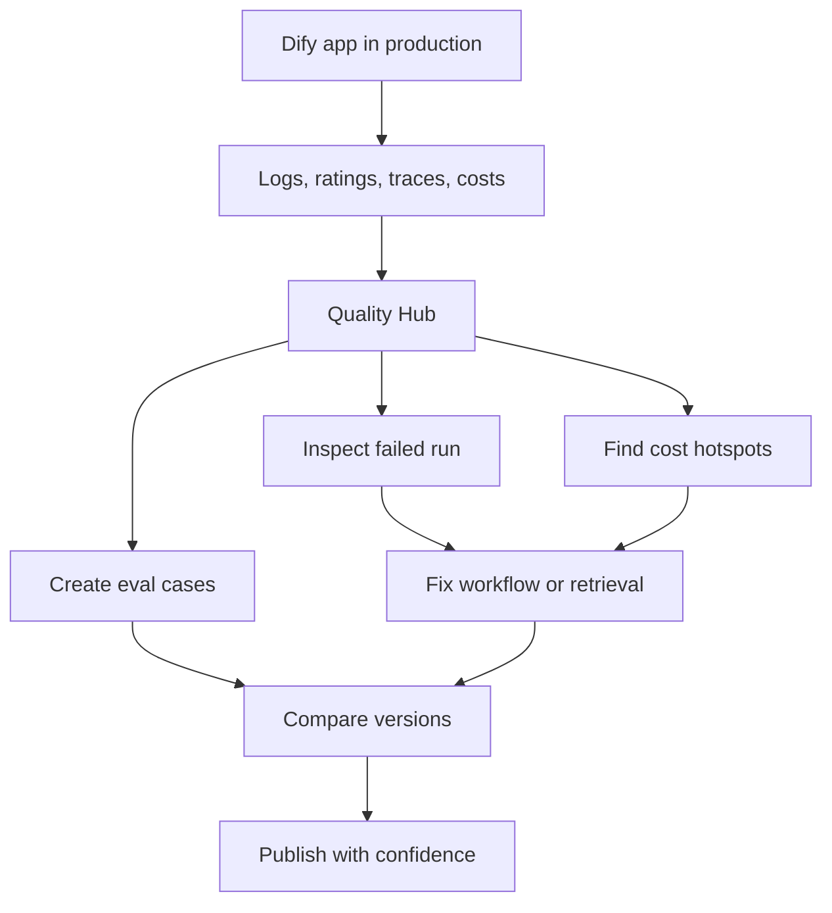

# Executive Summary: Dify Open-Source Product Opportunity

## Recommendation

Build **Dify Quality Hub**, a native evaluation, tracing, feedback triage, and cost analytics layer for Dify workflows, chatflows, agents, and RAG applications.

Dify is already strong at helping users build AI applications quickly. The next strategic unlock is helping teams prove those applications are good enough to operate, improve, and govern in production.

## Why This Matters

Dify describes itself as an open-source platform for building agentic workflows, with visual process definition, tools, data sources, and deployment for real AI applications ([Dify docs](https://docs.dify.ai/en/use-dify/getting-started/introduction)). The GitHub repository positions Dify as combining AI workflow, RAG pipeline, agent capabilities, model management, and observability integrations ([Dify GitHub](https://github.com/langgenius/dify)).

The product is crossing from prototype builder to production AI platform. That transition creates a new bottleneck:

- Teams can build workflows, but cannot easily prove quality.
- Teams can collect logs, but cannot easily turn them into eval datasets.
- Teams can integrate external tracing tools, but still need a native Dify decision loop.
- Enterprises need governance evidence before broad adoption.

## Selected Opportunity

**Dify Quality Hub** would unify:

- Evaluation datasets and eval runs.
- Draft vs published app comparisons.
- Node-level workflow traces.
- RAG retrieval and citation diagnostics.
- Feedback triage from logs and ratings.
- Cost and token analytics by app, node, provider, model, and user.
- Optional release gates before publishing.

## Business Impact

| Area | Expected impact |
|---|---|
| Adoption | New users see a credible production path, not just a prototype builder. |
| Retention | Teams return weekly to monitor quality, costs, and regressions. |
| Enterprise readiness | Admins gain evidence for risk, security, and compliance reviews. |
| Monetization | Scheduled evals, retention windows, reports, budgets, and governance can support paid tiers. |
| Moat | Dify becomes the system of record for AI app quality history and release decisions. |

## North Star Metric

**Weekly production improvement loops completed.**

Definition: a user reviews logs, feedback, traces, or evals; changes a prompt, model, workflow, or retrieval setting; runs a comparison; and publishes or rejects a release based on measured quality.

## Top Success Metrics

- 30 percent of active production workspaces create an eval suite within 90 days.
- 15 percent increase in 8-week retention for workspaces with published apps.
- 30 percent reduction in time from negative feedback to root cause.
- 20 percent of production workspaces use cost breakdown monthly.
- 10 percent lift in enterprise-qualified workspace expansion.

## Bottom Line

Dify should prioritize production quality management because it compounds every part of the platform: workflow, RAG, agents, logs, monitoring, collaboration, and enterprise adoption. The highest leverage contribution is not another node. It is the operating layer that helps users trust every node they already have.

