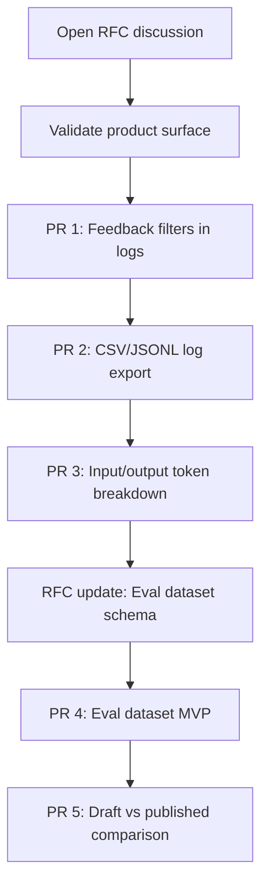

# Maintainer Submission Kit: Dify Quality Hub

## Purpose

This file converts the product strategy into an upstream-friendly contribution path for Dify maintainers.

The main principle: **start small, prove value, then expand.**

## Recommended Upstream Sequence



## Discussion To Open First

**Title:** RFC: Native Quality Hub for evals, traces, feedback triage, and cost analytics

**Opening post:**

```markdown
Dify helps teams build AI workflows quickly. As users move into production, a recurring need appears across logs, feedback, workflow usage, and tracing: teams need a native way to evaluate quality, debug failures, attribute cost, and decide whether a draft is safe to publish.

I propose exploring a phased Quality Hub:

1. Feedback filters and log export.
2. Input/output token breakdown for workflows.
3. Eval datasets created from logs.
4. Draft vs published comparison.
5. Node-level traces and RAG diagnostics.
6. Optional release gates.

Question for maintainers: should this live inside Monitoring first, or should Dify introduce a new Quality section over time?
```

## Best First PR

**PR title:** Add feedback rating and comment filters to application logs

### Why This PR First

- It is small and reviewable.
- It solves a visible user pain.
- It improves existing monitoring without requiring a new product surface.
- It creates the first step toward feedback triage and log-to-eval workflows.

### Acceptance Criteria

- Users can filter logs by positive rating, negative rating, no rating, and comment presence.
- Filters can combine with existing date/app/user filters.
- Empty states explain when no logs match.
- Existing log behavior remains unchanged when no filter is applied.
- Basic tests cover query behavior.
- Documentation includes one short example.

### Non-Goals

- No new eval dataset model.
- No release gates.
- No workflow runtime changes.
- No external observability replacement.

## Second PR

**PR title:** Export filtered logs as CSV and JSONL

### Acceptance Criteria

- Export respects active filters.
- Export includes prompt/input, answer/output, timestamp, app ID/name, conversation ID, rating, comment, model/provider if available, and token usage if available.
- JSONL format is suitable for future eval dataset import.
- Export excludes secrets and sensitive internal config fields.

## Third PR

**PR title:** Track workflow input and output tokens separately where available

### Acceptance Criteria

- Workflow usage stores input tokens and output tokens separately when provider metadata supports it.
- UI clearly labels unavailable metadata.
- Existing total token calculations remain backward compatible.
- Tests cover providers with full, partial, and missing token metadata.

## Contribution Quality Bar

Before opening upstream work:

- Link every proposal to public evidence.
- Keep the first PR small.
- Make non-goals explicit.
- Avoid implying that Dify should replace Langfuse, Phoenix, Opik, Weave, or LangSmith.
- Respect Dify's existing product architecture and naming.
- Ask maintainers where the feature belongs before building large UI.

## Maintainer-Friendly Summary

Quality Hub should not be proposed as a single giant feature drop. It should be proposed as a staged improvement to Dify's production feedback loop:

1. Better log triage.
2. Better export and measurement.
3. Better usage analytics.
4. Eval datasets.
5. Release comparisons.
6. Enterprise governance.
