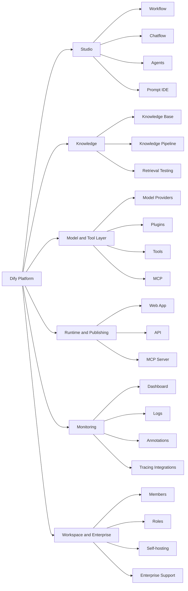

# Market Research and Product Deconstruction

## What Problem Dify Solves

Dify solves the AI application assembly problem. Modern AI apps require prompt orchestration, model selection, RAG, data ingestion, tools, workflow logic, deployment surfaces, APIs, logs, and monitoring. Dify packages those pieces into an open-source, visual, production-oriented platform.

Dify's public positioning emphasizes agentic workflows, autonomous agents, RAG pipelines, and management at team scale ([Dify website](https://dify.ai/)). The docs define Dify as an open-source platform for building agentic workflows visually and deploying AI apps that solve real problems ([Dify docs](https://docs.dify.ai/en/use-dify/getting-started/introduction)).

## Primary Users

| Segment | Persona | Core need | Dify value |
|---|---|---|---|
| Solo builders | Indie hackers, consultants | Build AI apps fast | Low-code workflow, templates, deployable apps |
| Startup teams | Founders, PMs, engineers | Launch AI features without a full AI platform team | RAG, model management, APIs, visual workflows |
| AI engineers | LLM app developers | Compose models, tools, and retrieval with control | Workflow canvas plus extensibility |
| Operations teams | Support, sales, HR, internal ops | Automate knowledge-heavy workflows | Chat apps, workflow automation, knowledge bases |
| Enterprise platform teams | IT, AI platform, security | Centralize safe AI app development | Self-hosting, enterprise deployment, workspace controls |
| Agencies and SIs | AI implementation partners | Build repeatable client solutions | Open-source customization and deployment flexibility |

## Jobs To Be Done

| Job | Situation | Desired outcome | Product fit |
|---|---|---|---|
| Build a RAG assistant | A team has documents and wants a useful AI support app | Accurate answers with source grounding | Strong |
| Prototype an AI workflow | A team needs to validate an idea quickly | Demo in hours, not weeks | Very strong |
| Deploy a backend AI service | A developer wants an API around an LLM workflow | Stable endpoint and app lifecycle | Strong |
| Connect models and tools | A workflow requires multiple steps and actions | Visual orchestration and reusable tools | Strong |
| Monitor production | An operator needs usage, cost, and feedback visibility | Dashboard and logs | Partial |
| Prove quality | A team needs regression tests and release confidence | Eval suite and comparison | Gap |
| Govern enterprise use | Security and compliance need audit evidence | Access, retention, quality, reports | Partial |

## Product Pillars

## Current Value Proposition

Dify helps teams go from AI idea to deployed agentic application with one platform that includes a visual builder, RAG, model/provider abstraction, tools/plugins, APIs, and monitoring.

## Differentiation

- Open-source and self-hostable.
- Visual workflow builder with AI-native primitives.
- RAG and Knowledge Pipeline built into the product.
- Model-provider neutrality.
- Plugin and MCP ecosystem.
- Built-in logs, dashboard, annotations, and external tracing integrations.
- Useful for both low-code builders and developers.

## Likely Product Strategy

Dify appears to be moving toward a production agentic workflow platform strategy:

1. Capture the open-source developer and builder funnel.
2. Expand enterprise RAG and workflow use cases.
3. Build ecosystem leverage through plugins, marketplace, templates, and MCP.
4. Monetize via Dify Cloud, teams, enterprise support, and self-hosted enterprise controls.
5. Convert prototype adoption into production retention through monitoring, governance, and collaboration.

## Key Growth Drivers

- Strong GitHub traction and open-source social proof.
- Demand for self-hosted AI infrastructure.
- Enterprise need for model-neutral AI workflows.
- RAG adoption inside support, knowledge management, and internal ops.
- Agentic workflow and MCP momentum.
- Templates and community examples.

## Biggest Product Risks

| Risk | Product implication |
|---|---|
| Quality proof gap | Users may build but hesitate to scale. |
| Debugging complexity | Complex workflows can be hard to troubleshoot. |
| Enterprise governance gap | Security and risk teams may block broad rollout. |
| RAG reliability expectations | Retrieval failures undermine user trust. |
| Automation competition | n8n can win broader workflow automation use cases. |
| Observability fragmentation | External tools help, but Dify still needs a native improvement loop. |

