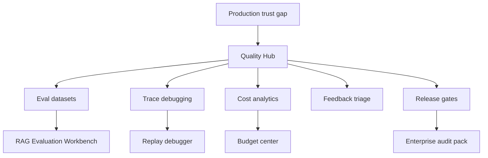

# Product Opportunity Backlog

## Prioritization Method

RICE formula: Reach x Impact x Confidence / Effort. Scores are directional estimates based on public evidence, competitor pressure, and strategic fit.

## Ranked Backlog

| Rank | Opportunity | Problem | Reach | Impact | Confidence | Effort | RICE | Strategic value |
|---:|---|---|---:|---:|---:|---:|---:|---|
| 1 | Dify Quality Hub | No unified eval, trace, feedback, and cost loop | 10 | 5 | 8 | 2.5 | 160 | Very high |
| 2 | RAG Evaluation Workbench | RAG quality is hard to prove | 8 | 5 | 8 | 2.5 | 128 | Very high |
| 3 | Workflow Release Gates | No systematic pre-publish regression checks | 7 | 5 | 8 | 2.5 | 112 | High |
| 4 | Cost and Budget Center | Workflow costs are hard to attribute | 9 | 4 | 8 | 2.7 | 107 | High |
| 5 | Feedback Triage Console | Ratings and comments are not operationalized | 8 | 4 | 8 | 2.5 | 102 | High |
| 6 | Node-level Replay Debugger | Complex failures are hard to reproduce | 7 | 5 | 7 | 4 | 61 | High |
| 7 | Native Scheduler and Batch Runner | Automation gap vs n8n | 6 | 4 | 7 | 3 | 56 | Medium-high |
| 8 | Enterprise Audit Pack | Governance evidence is fragmented | 5 | 5 | 7 | 3.5 | 50 | High |
| 9 | Plugin Quality Certification | Marketplace trust varies | 6 | 3 | 7 | 3 | 42 | Medium |
| 10 | App Version Environments | Dev/stage/prod lifecycle is not first-class | 5 | 4 | 6 | 4 | 30 | High |
| 11 | Connector Reliability Initiative | Some connectors create trust gaps | 5 | 4 | 6 | 3.5 | 34 | Medium |
| 12 | Frontend Experience Builder | Some teams need richer app UX | 4 | 3 | 6 | 4 | 18 | Medium |

## Opportunity Backlog Map

## Why Quality Hub Ranks First

Quality Hub absorbs several high-value opportunities into one coherent contribution:

- It includes feedback triage.
- It includes cost analytics.
- It creates the foundation for RAG evals.
- It enables release gates.
- It supports enterprise audit workflows.
- It turns monitoring from passive reporting into active improvement.

## Low-Risk Entry Points

The best first contributions are not the entire platform. They are narrow, maintainable improvements:

1. Add input/output token breakdown to workflow usage where provider metadata supports it.
2. Add log filtering by feedback rating and comment status.
3. Add CSV/JSON export for logs and eval examples.
4. Add a basic eval dataset model and UI.
5. Add draft vs published comparison.

