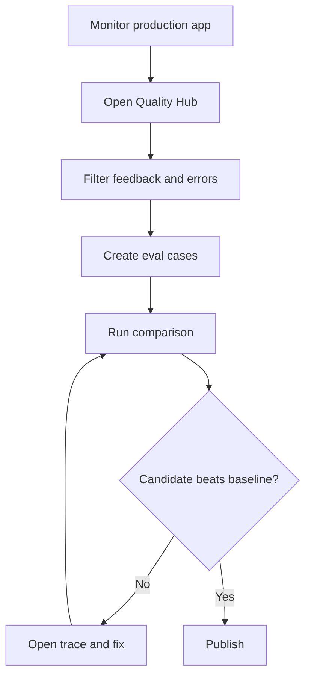

# RFC: Dify Quality Hub

## Summary

Introduce **Dify Quality Hub**, a native production quality workflow for Dify apps, workflows, chatflows, agents, and RAG pipelines.

The goal is to help users answer four production questions:

1. Did this change improve quality?
2. Why did this run fail?
3. What is driving cost and latency?
4. Is this app ready to publish?

## Motivation

Dify already helps users build quickly. As more users deploy production apps, they need repeatable evaluation, node-level tracing, feedback triage, and cost attribution.

Current Dify docs show dashboard metrics, logs, annotation systems, and tracing integrations ([Dashboard](https://docs.dify.ai/en/use-dify/monitor/analysis), [Logs](https://docs.dify.ai/en/use-dify/monitor/logs), [Phoenix integration](https://docs.dify.ai/en/use-dify/monitor/integrations/integrate-phoenix)). Community signals show demand for execution-chain debugging, log export, rating filters, and token breakdown ([Discussion #11348](https://github.com/langgenius/dify/discussions/11348), [Discussion #3778](https://github.com/langgenius/dify/discussions/3778), [Issue #34315](https://github.com/langgenius/dify/issues/34315)).

## Goals

- Convert production logs and feedback into eval datasets.
- Compare draft and published app versions.
- Show node-level traces for workflow debugging.
- Attribute cost and tokens by app, node, provider, model, and user.
- Provide basic quality gates before publishing.
- Preserve external observability integrations.

## Non-Goals

- Replace specialist observability tools.
- Build a full CI/CD environment system.
- Rewrite the workflow runtime.
- Add automated prompt rewriting in MVP.

## Proposed UX

## Proposed Data Model

| Entity | Description |
|---|---|
| EvalDataset | Workspace/app-scoped collection of test examples. |
| EvalExample | Input, expected output, tags, source run, metadata. |
| EvalSuite | Dataset plus evaluator configuration. |
| EvalRun | Execution of suite against app version/config. |
| EvalResult | Per-example output, score, pass/fail, trace link. |
| TraceRun | Workflow run with node-level events. |
| TraceNodeEvent | Node input/output summary, status, latency, tokens, cost, error. |

## MVP Proposal

1. Feedback filters and log export.
2. Input/output token usage tracking for workflows.
3. Eval dataset creation from logs and CSV/JSONL.
4. Eval run and comparison UI.
5. Node-level trace drawer.
6. Basic RAG citation/groundedness checks.

## Open Questions

- Which evaluator API should be public first?
- How much trace payload should be stored by default?
- What belongs in Community Edition vs paid/enterprise?
- How should Quality Hub integrate with existing app versioning?
- Should release gates be advisory first, then enforceable later?

## Maintainer Ask

Feedback requested on:

- Preferred MVP boundary.
- Data model compatibility with existing logs and workflow runs.
- UI placement: new `Quality` section vs inside `Monitoring`.
- Packaging and governance constraints.
- Whether a small first PR should target log filters, log export, or token breakdown.

