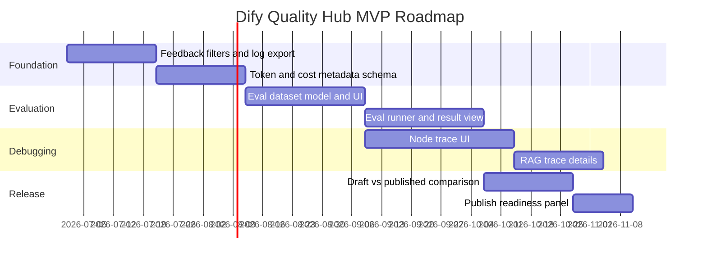

# Roadmap Proposal

## Roadmap Principles

- Start with workflow improvements users already ask for: filters, exports, and token breakdown.
- Build durable primitives before advanced governance.
- Keep core quality workflows available in self-hosted open source.
- Package enterprise controls around retention, policies, reports, and approvals.

## Milestone Plan

| Milestone | Scope | Outcome |
|---|---|---|
| M1 | Feedback filters, log export, input/output token breakdown | Immediate analytics value and low-risk contribution surface |
| M2 | Eval dataset CRUD and CSV/JSONL import | Users can create reusable quality datasets |
| M3 | Eval runner and draft vs published comparison | Users can make release decisions with evidence |
| M4 | Node-level trace UI and RAG diagnostics | Users can debug failures and retrieval gaps |
| M5 | Release gates and scheduled evals | Teams can automate production quality checks |
| M6 | Enterprise reports, budgets, retention policies | Dify gains stronger enterprise and monetization story |

## MVP Roadmap

## Version 2

- Scheduled evals.
- Drift alerts based on feedback and score trends.
- Deeper RAG metrics: retrieval recall proxy, citation grounding, stale source detection.
- Release gates and review approval.
- Model/prompt/retrieval experiment matrix.
- Webhooks and CI integration.

## Version 3

- Enterprise quality scorecards.
- Workspace budget and cost policies.
- Audit logs for evaluator, dataset, prompt, workflow, model, and publish changes.
- Data classification and trace redaction policies.
- Multi-environment promotion.
- Cross-workspace governance dashboards.

## Packaging Recommendation

| Capability | Community | Cloud/Team | Enterprise |
|---|---|---|---|
| Manual eval suites | Yes | Yes | Yes |
| Log-to-eval conversion | Yes | Yes | Yes |
| Basic trace view | Yes | Yes | Yes |
| Scheduled evals | Limited | Yes | Yes |
| Advanced retention | Configurable self-host | Paid tier | Custom |
| Release gates | Basic | Yes | Yes |
| Audit reports | No | Limited | Yes |
| Budget policies | No | Yes | Yes |

