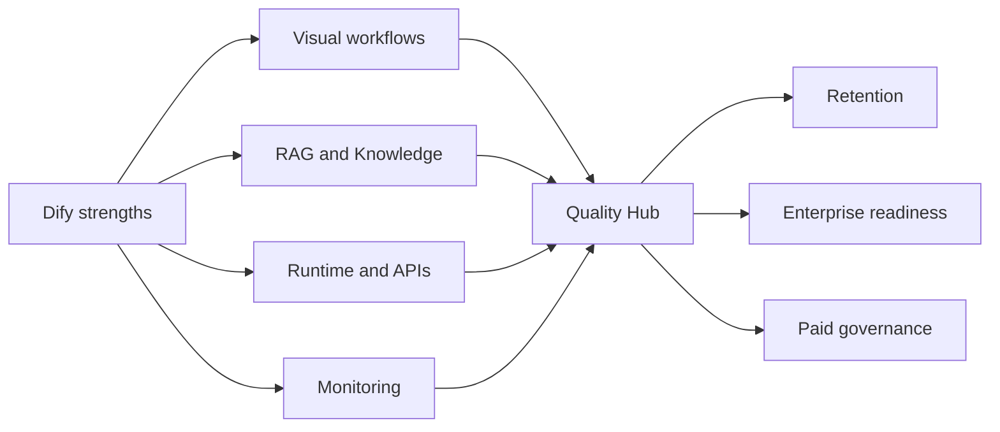

# Selected Opportunity: Dify Quality Hub

## Opportunity Statement

Create **Dify Quality Hub**, a native production quality layer that lets teams evaluate, trace, compare, and optimize every Dify app, workflow, agent, and RAG pipeline from one workspace-level experience.

## Why Now

Dify's public strategy and release direction show a move toward production agentic workflows. The v1.9 release discussion introduced Knowledge Pipeline and a queue-based graph engine to make workflows more robust and debuggable ([Dify discussion #26138](https://github.com/langgenius/dify/discussions/26138)). Dify also supports monitoring dashboards, logs, annotations, and tracing integrations ([Dashboard docs](https://docs.dify.ai/en/use-dify/monitor/analysis), [Logs docs](https://docs.dify.ai/en/use-dify/monitor/logs), [Phoenix integration docs](https://docs.dify.ai/en/use-dify/monitor/integrations/integrate-phoenix)).

The raw ingredients exist. The missing layer is the product workflow that turns raw production signals into release decisions.

## Why Dify

Dify controls the canvas, runtime, knowledge pipeline, deployment surface, and monitoring surface. That means Dify can do something external observability tools cannot do alone: connect quality insight directly to workflow editing, model selection, retrieval settings, and publishing decisions.

## Expected Impact

| Dimension | Impact |
|---|---|
| User impact | Faster debugging, clearer quality measurement, safer releases. |
| Business impact | Higher retention, stronger enterprise conversion, monetizable governance. |
| Adoption impact | New users see a path from demo to production. |
| Community impact | Issues become reproducible eval cases and traces. |
| Maintainer impact | Better structured bug reports and clearer contribution boundaries. |

## North Star Metric

**Weekly production improvement loops completed.**

## Success Metrics

| Metric | Target |
|---|---|
| Eval adoption | 30 percent of production workspaces create an eval suite in 90 days |
| Retention | 15 percent increase in 8-week retention for workspaces with published apps |
| Debug speed | 30 percent reduction in time from negative feedback to root cause |
| Cost visibility | 20 percent of production workspaces use cost breakdown monthly |
| Enterprise conversion | 10 percent lift in enterprise-qualified workspace expansion |
| Quality improvement | 25 percent of eval-running apps improve pass rate within 30 days |

## Strategic Fit



## Wireframe: Quality Hub Overview

```text
+--------------------------------------------------------------------------------+
| Dify / Workspace / Quality Hub                                      Date range  |
+--------------------------------------------------------------------------------+
| Quality Score 82   Eval Pass 91%   Cost $184.22   P95 Latency 4.8s   Errors 2% |
+----------------------------+---------------------------------------------------+
| Apps                       | Quality trend                                     |
| [ ] Support Agent          | 95 |                              *              |
| [ ] Contract Reviewer      | 90 |                       *  *                  |
| [ ] Sales Research Flow    | 85 |             *  *   *                         |
| [ ] HR Screener            | 80 | *   *                                         |
+----------------------------+---------------------------------------------------+
| Failure Hotspots              | Recent Regressions                              |
| Retrieval: 18 failed cases    | Support Agent v12 -> v13: citation score -8%    |
| LLM Node: 11 cost spikes      | Contract Reviewer: latency +21%                 |
| HTTP Tool: 7 timeouts         | Sales Flow: tool error rate +4%                 |
+--------------------------------------------------------------------------------+
| [Run eval] [Create dataset] [Open feedback] [Export report]                    |
+--------------------------------------------------------------------------------+
```

