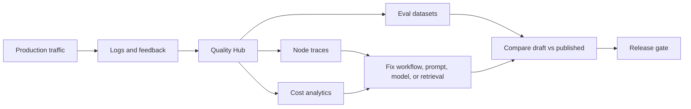

# Open Source PM Portfolio

Strategic product management contribution portfolio for open-source AI infrastructure projects.

This repository currently contains a complete discovery and contribution package for [Dify](https://dify.ai/), an open-source platform for building agentic workflows, RAG applications, and AI agents.

## Project: Dify Quality Hub

The recommended contribution is **Dify Quality Hub**, a native evaluation, tracing, feedback triage, and cost analytics layer for Dify workflows, chatflows, agents, and RAG apps.

Core thesis: Dify has already won the "build fast" motion for many AI app builders. The next strategic unlock is helping teams prove quality, debug failures, control cost, and govern production AI apps from inside Dify.

## Repository Map

| File | Purpose |
|---|---|
| [Dify/executive-summary.md](Dify/executive-summary.md) | CEO/CPO-level summary and selected recommendation |
| [Dify/market-research.md](Dify/market-research.md) | Dify product deconstruction, users, JTBD, product architecture |
| [Dify/competitive-analysis.md](Dify/competitive-analysis.md) | Competitive matrix, SWOT, positioning, feature gaps |
| [Dify/user-research.md](Dify/user-research.md) | Public feedback synthesis, issue/discussion review, pain point scoring |
| [Dify/opportunity-backlog.md](Dify/opportunity-backlog.md) | Ranked product opportunities using RICE and strategic value |
| [Dify/selected-opportunity.md](Dify/selected-opportunity.md) | Why Dify Quality Hub is the highest leverage opportunity |
| [Dify/prd.md](Dify/prd.md) | Full PRD with personas, requirements, metrics, risks, and wireframes |
| [Dify/roadmap.md](Dify/roadmap.md) | MVP, V2, V3 roadmap and sequencing |
| [Dify/rfc.md](Dify/rfc.md) | Maintainer-ready RFC draft |
| [Dify/github-feature-proposal.md](Dify/github-feature-proposal.md) | GitHub issue/discussion-ready feature proposal |
| [Dify/contribution-plan.md](Dify/contribution-plan.md) | Concrete open-source contribution plan |
| [Dify/portfolio-case-study.md](Dify/portfolio-case-study.md) | Hiring-manager-ready case study |
| [Dify/lessons-learned.md](Dify/lessons-learned.md) | Reflection on PM discovery and contribution strategy |
| [CHANGELOG.md](CHANGELOG.md) | Files created and modified |

## Research Inputs

Primary sources include:

- [Dify website](https://dify.ai/)
- [Dify GitHub repository](https://github.com/langgenius/dify)
- [Dify docs introduction](https://docs.dify.ai/en/use-dify/getting-started/introduction)
- [Dify monitoring dashboard docs](https://docs.dify.ai/en/use-dify/monitor/analysis)
- [Dify logs docs](https://docs.dify.ai/en/use-dify/monitor/logs)
- [Dify tracing integrations](https://docs.dify.ai/en/use-dify/monitor/integrations/integrate-phoenix)
- [Dify v1.9 release discussion](https://github.com/langgenius/dify/discussions/26138)
- [Execution chain discussion #11348](https://github.com/langgenius/dify/discussions/11348)
- [Log export discussion #3778](https://github.com/langgenius/dify/discussions/3778)
- [Workflow usage token issue #34315](https://github.com/langgenius/dify/issues/34315)

Competitors reviewed:

- [Langflow](https://www.langflow.org/)
- [Flowise](https://flowiseai.com/)
- [Open WebUI](https://docs.openwebui.com/features/)
- [LangGraph](https://docs.langchain.com/oss/python/langgraph/overview)
- [n8n AI](https://n8n.io/ai/)
- [CopilotKit](https://www.copilotkit.ai/)

## Recommended Contribution

Open a Dify GitHub discussion or RFC proposing Dify Quality Hub:

1. Start with low-risk improvements: feedback filters, log export, and input/output token breakdown.
2. Add eval dataset creation from logs and CSV/JSONL.
3. Add eval comparison between draft and published app versions.
4. Add node-level trace detail and RAG diagnostics.
5. Add release gates, scheduled evals, cost budgets, and enterprise reports.

## Portfolio Positioning

This project demonstrates:

- Open-source product discovery.
- Competitive strategy.
- User-research synthesis from public signals.
- RICE prioritization.
- PRD writing.
- RFC writing.
- Enterprise product strategy.
- AI application observability and evaluation product thinking.

## Public Repo Policy

This portfolio repository intentionally tracks markdown contribution artifacts only. Personal Word documents and generated office artifacts are excluded through `.gitignore`.
